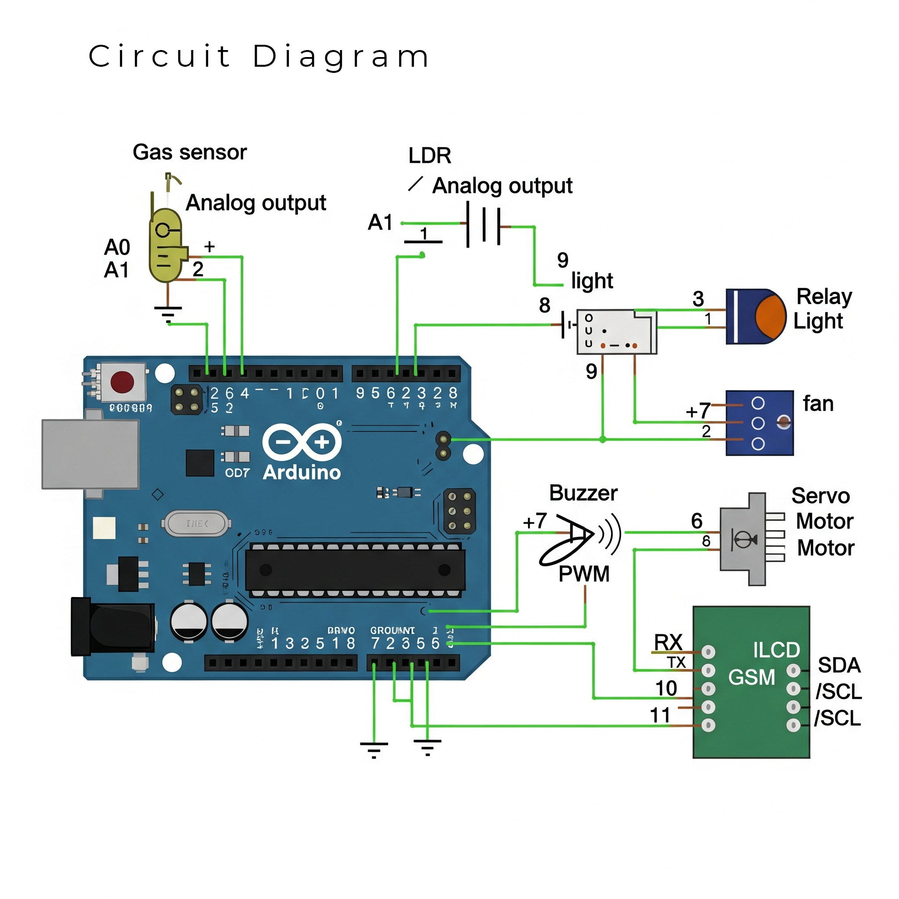

# 🚀 Arduino Smart Home Controller

An intelligent, Arduino-based system for home automation that integrates gas leak detection, remote SMS control via a GSM module, and real-time status monitoring on an LCD.

This project enhances home safety and convenience by providing automated responses to hazards like gas leaks and allowing remote control over appliances with simple text messages.

---

## ✨ Key Features

-   **Gas Leak Detection**: Automatically detects gas leaks using an MQ-series sensor, triggers a loud buzzer, and activates a fan to vent the area.
-   **Remote SMS Control**: Control lights and fans remotely by sending commands (e.g., "ONL") via a GSM module.
-   **Real-time LCD Display**: A 16x2 I2C LCD provides instant updates on system status, sensor readings, and command confirmations.
-   **Safety Lock**: For safety, the system prevents the fan from being turned off via SMS as long as a gas leak is detected.

---

## 🏗️ System Architecture

The system's logic and connections are outlined in the diagrams below.

### Component Block Diagram

### System Flowchart

### Circuit Diagram
For detailed electrical connections, refer to the full schematic.

---

## 🛠️ Hardware & Software

### Hardware Components

| Component           | Type / Example         | Purpose                                |
| ------------------- | ---------------------- | -------------------------------------- |
| Microcontroller     | Arduino Uno            | Central processing unit                |
| Gas Sensor          | MQ-2 / MQ-5            | Detects flammable gas and smoke        |
| Light Sensor        | LDR                    | Measures ambient light levels          |
| Relay Module        | 2-Channel, 5V          | Switches high-voltage devices (fan/light) |
| GSM Module          | SIM900A / SIM800L      | Handles SMS communication              |
| Display             | 16x2 I2C LCD           | Shows real-time status                 |
| Sound Alert         | Piezo Buzzer           | Audible alarm for gas leaks            |
| Physical Actuator   | Servo Motor (SG90)     | Visual indicator or to operate a valve |
| Wires & Board       | Jumper Wires, Breadboard | For connecting all components          |

### Software and Libraries

-   **[Arduino IDE](https://www.arduino.cc/en/software)**
-   **Required Libraries**:
    -   `SoftwareSerial.h`
    -   `LiquidCrystal_I2C.h`
    -   `Servo.h`

---

## ⚙️ Installation & Setup

1.  **Assemble Hardware**: Connect all components according to the **Circuit Diagram**.
2.  **Install Libraries**: Open the Arduino IDE, go to `Sketch` > `Include Library` > `Manage Libraries...`, and install the libraries listed above.
3.  **Upload Code**: Open the `src/smart_home_controller.ino` file, select your board (Arduino Uno) and port, then upload.
4.  **Prepare GSM Module**: Insert an active SIM card with credit/data into the GSM module and power the system.

---

## 📲 Usage Guide

Control your devices by sending the following SMS commands to the phone number of the SIM card in the GSM module.

| SMS Command | Action                                       |
| ----------- | -------------------------------------------- |
| `ONL`       | Turns the Light ON.                          |
| `OFFL`      | Turns the Light OFF.                         |
| `ONF`       | Turns the Fan ON.                            |
| `OFFF`      | Turns the Fan OFF (disabled during gas leak).|
| `STATUS`    | Requests a system status report via SMS.     |

---

## 📄 License

This project is licensed under the **MIT License**. See the [LICENSE](LICENSE) file for more details.
